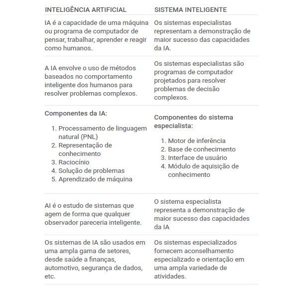

# Sistema Especialista Anxiety Detection

## Ansiedade 
- O Psicólogo Consultória (2021), afirma que a ansiedade é um estado onde prevalece a incerteza e a angústia, caracterizadas pelo sentimento de medo e insegurança. 

## O que é um Sistema Especialista (SE) ?

- Desse modo, de acordo com TelefonicaTech (2022), um sistemas Especialistas (SE) podem ser considerados como um subconjunto da IA. Um Sistema Especialista é um sistema que utiliza o conhecimento humano capturado num computador para resolver problemas que normalmente seriam resolvidos por especialistas humanos.
- Segundo TelefonicaTech (2022), os sistemas especialistas podem ser considerados como o início da inteligência artificial. Foram desenvolvidos pela comunidade da IA em meados da década de 1960. Neste período de investigação no campo da IA, acreditava-se que com a soma de algumas regras de raciocínio e computadores poderosos, poderia ser produzido um especialista com um desempenho sobre-humano. 

## Diferença entre um IA x SE ?

Fonte em Acervo Lima (2023)

## Referências

BROTTO, Amauri. Perguntas de psicólogos para pacientes: quais são e quando são feitas. Psitto em 10 de novembro de 2020. Disponível em: <https://www.psitto.com.br/blog/perguntas-psicologos/ >. Acesso em: 09 de set. de 2023.

PIMENTA, Tatiana. Como anda seu nível de depressão, ansiedade e estresse?. Virtual Blog. Disponível em: <https://www.vittude.com/blog/test/teste-depressao-ansiedade-stress-dass21/ >. Acesso em: 10 de set. de 2023.

EXPERT SYSTEM. Sistema especialista. TelefonicaTech. Disponível em: <https://aiofthings.telefonicatech.com/pt/recursos/datapedia/sistema-especialista >. Acesso em: 11 de set. de 2023.

Acervo Lima. Diferença entre AI e Sistema Especializado. Acervo Lima. Disponível em: <https://acervolima.com/diferenca-entre-ai-e-sistema-especializado/ >. Acesso em: 11 de set. de 2023.
